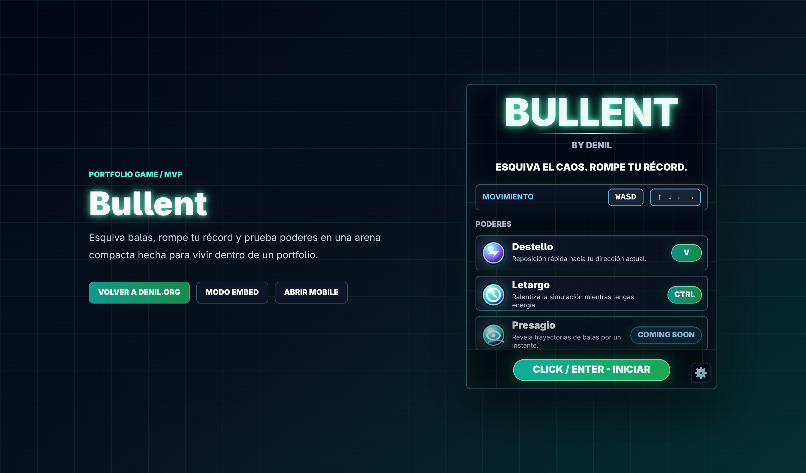
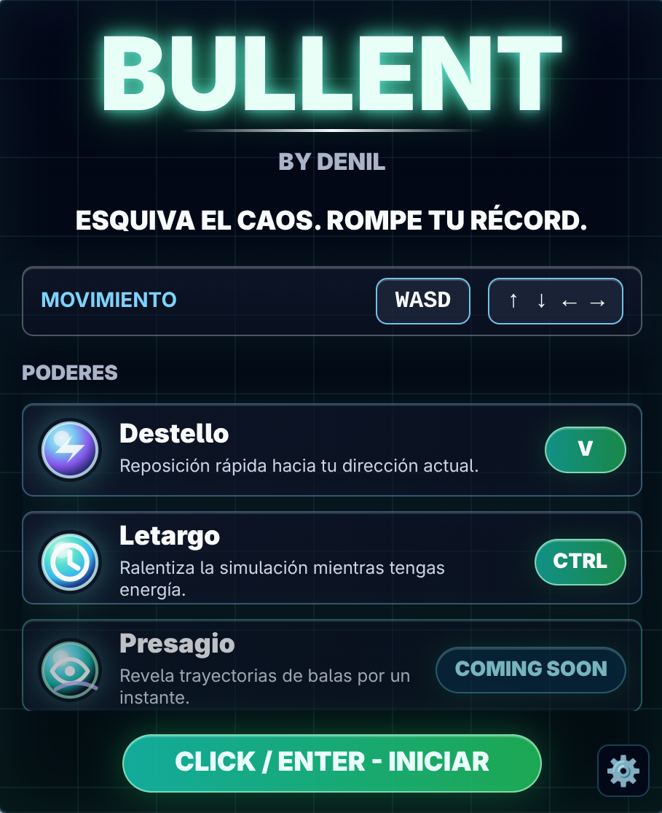

<div align="center">

# 🟣 Bullent

### Juego web minimalista de esquivar balas para portfolios interactivos


**Aguanta más tiempo. Esquiva el caos.**
Un minijuego 2D embebible, diseñado para vivir dentro de un portfolio sin depender de frameworks pesados.

[Jugar Bullent](https://bullent.denil.org/) ·
[Modo embed](https://bullent.denil.org/?embed=1) ·
[Modo mobile](https://bullent.denil.org/?mobile=1)

</div>

---

## 🖼️ Capturas





---

## 🎮 Qué es Bullent

**Bullent** es un juego web 2D minimalista donde el jugador controla un círculo dentro de una arena mientras distintos disparadores lanzan balas hacia su posición.

Las balas rebotan en las paredes y se acumulan durante la partida, haciendo que cada segundo sea más peligroso que el anterior.

> [!IMPORTANT]
> Bullent no busca ser un juego grande ni un motor complejo.
> Es una experiencia pequeña, pulida y embebible para demostrar interacción, arquitectura frontend y diseño de dificultad en navegador.

---

## 🚦 Estado actual

El MVP ya está desplegado en:

```txt
https://bullent.denil.org/
```

Modos disponibles:

| Modo | URL | Uso |
| --- | --- | --- |
| 🕹️ Standalone | `https://bullent.denil.org/` | Página propia del juego |
| 🧩 Embed | `https://bullent.denil.org/?embed=1` | Iframe desktop limpio para portfolio |
| 📱 Mobile | `https://bullent.denil.org/?mobile=1` | Experiencia fullscreen para celular/tablet |

Incluye:

* 🕹️ survival infinito;
* 🏆 récord local con `localStorage`;
* ⚙️ configuración de nivel desde JSON y panel in-game;
* 🧩 modo embebible por `iframe`;
* 📱 modo mobile fullscreen con controles táctiles;
* ⚡ poderes de jugador;
* ☁️ deploy estático en Cloudflare Pages.

---

## 🧠 Idea principal

El jugador empieza en el centro de la arena.

Un disparador lanza balas hacia la posición actual del jugador. Las balas rebotan, se acumulan y convierten la arena en un espacio cada vez más peligroso.

La meta es simple:

> [!TIP]
> Sobrevivir el mayor tiempo posible sin tocar ninguna bala.

---

## ⚡ Reglas del juego

| Elemento        | Comportamiento                                |
| --------------- | --------------------------------------------- |
| 🟣 Jugador      | Círculo controlado con teclado o gestos touch |
| 🎯 Disparadores | Apuntan hacia la posición actual del jugador  |
| 💥 Balas        | Rebotan contra las paredes                    |
| ☠️ Daño         | Una bala toca al jugador y termina la partida |
| ⏱️ Objetivo     | Aguantar el mayor tiempo posible              |
| 🧩 Nivel        | Configurable mediante JSON o panel in-game    |
| 🏆 Récord       | Mejor tiempo guardado localmente              |

---

## 🕹️ Controles

### Desktop

```txt
W / ↑       → moverse arriba
A / ←       → moverse izquierda
S / ↓       → moverse abajo
D / →       → moverse derecha
V           → Destello
Ctrl hold   → Letargo
```

### Mobile fullscreen

```txt
Zona derecha drag        → movimiento
Zona izquierda doble tap → Destello
Zona izquierda hold      → Letargo
```

> [!NOTE]
> El modo `?embed=1` está reservado para escritorio y no muestra controles touch.

---

## 📈 Dificultad

La dificultad principal nace de tres ideas:

* el nivel puede configurarse con uno o más disparadores;
* las balas rebotan contra las paredes;
* las balas se acumulan durante la partida.

Esto genera un sistema simple, pero con comportamiento emergente.

| Parámetro | Controla |
| --------- | -------- |
| 🎯 Disparadores | Cantidad, posición y cadencia |
| 💥 Balas | Tamaño, velocidad y máximo acumulado |
| 🟣 Jugador | Tamaño y velocidad |
| 🧱 Arena | Tamaño del espacio jugable |
| 🐢 Poderes | Energía, cooldown y escala temporal |

> [!WARNING]
> La dificultad puede escalar rápido.
> Parte del objetivo del proyecto es estudiar cómo ajustar la curva para mantener al jugador en una zona de flujo.

---

## 🧱 Decisiones técnicas

Bullent se ejecuta completamente en el navegador.

Stack:


```txt
TypeScript
Canvas 2D
Vite
Tailwind CSS
CSS variables
Cloudflare Pages
```

No requiere backend, base de datos ni SSR para el MVP.

---

## 🧩 Arquitectura

Bullent usa una arquitectura pequeña y directa.

| Archivo / módulo | Responsabilidad |
| ---------------- | --------------- |
| `src/core.ts` | Lógica pura testeable: movimiento, balas, colisiones, configuración |
| `src/main.ts` | Loop, input, render, DOM, modos de URL |
| `src/style.css` | Estilos, start screen, embed, mobile fullscreen |
| `public/levels.json` | Balance del nivel |
| `public/powers.json` | Balance interno de poderes |
| `docs/SPEC*.md` | Specs del proceso SDD |

La configuración se mantiene como datos simples:

```txt
niveles
poderes
colores
tema visual
constantes del juego
valores de balance
```

> [!NOTE]
> El objetivo no es crear una arquitectura pesada, sino separar lo suficiente para que el juego pueda crecer sin volverse difícil de mantener.

---

## 🎨 Estilo visual

La primera versión usa una estética **minimalista neón / glassmorphism**.

El estilo está separado de la lógica del juego para permitir cambios visuales sin tocar reglas internas.

Temas posibles a futuro:

| Tema         | Descripción                                       |
| ------------ | ------------------------------------------------- |
| 🟣 Neon      | Brillos, fondo oscuro y colores intensos          |
| 🟢 Toxic     | Verde/cyan arcade, más agresivo                   |
| ⚪ Clean      | Minimalista, suave y de bajo contraste            |
| 🕹️ Retro    | Estética arcade o pixel-inspired                  |
| 🌃 Cyberpunk | Alto contraste, glow agresivo y colores saturados |
| ⚫ Mono       | Blanco, negro y escala de grises                  |

---

## 🌐 Embebido en portfolio

Bullent está pensado para vivir como una app independiente y ser embebido en otro sitio mediante un `iframe`.

```html
<iframe
  src="https://bullent.denil.org/?embed=1"
  width="460"
  height="560"
  title="Bullent"
  loading="lazy"
></iframe>
```

Para mobile, lo recomendado es abrir otra pestaña:

```txt
https://bullent.denil.org/?mobile=1
```

### Ventajas

* El juego puede actualizarse sin tocar el portfolio.
* Puede compartirse como enlace independiente.
* Puede reutilizarse en otras webs.
* No contamina la arquitectura del sitio principal.
* Si el juego falla, no rompe el portfolio.

---

## 🚀 Deploy

Bullent está preparado para desplegarse como sitio estático en Cloudflare Pages.

```txt
Framework preset: Vite
Build command: pnpm build
Build output directory: dist
```

Flujo sugerido:

```txt
Desarrollo local
→ Build estático
→ Deploy en Cloudflare Pages
→ Dominio bullent.denil.org
→ Embed mediante iframe en el portfolio
```

---

## 🧪 Desarrollo

Instalar dependencias:

```bash
pnpm install
```

Servidor local:

```bash
pnpm dev
```

Checks:

```bash
pnpm selfcheck
pnpm build
```

---

## 🧪 Qué busca enseñar este proyecto

Bullent no es solo un juego pequeño. También es una excusa para practicar fundamentos importantes de software frontend.

| Área              | Aprendizaje                                            |
| ----------------- | ------------------------------------------------------ |
| 🎮 Game loop      | Actualización continua del estado del juego            |
| 🧭 Input handling | Teclado, touch, gestos y prioridades de input          |
| 🧮 Colisiones     | Detección entre círculos y límites                     |
| 🌀 Física simple  | Movimiento, velocidad y rebotes                        |
| 🎨 Rendering      | Dibujo en Canvas 2D                                    |
| 🧠 Estado         | Ready, running, dead, restart                          |
| 📈 Dificultad     | Balance, progresión y zona de flujo                    |
| 🧩 Modularidad    | Separación entre lógica, render, input y configuración |
| 🌐 Distribución   | Deploy estático, rutas por modo e iframe               |

---

## 🗺️ Futuras ideas

Bullent puede crecer de forma progresiva sin perder su esencia minimalista.

### Roadmap de poderes

#### Jugador

| Estado | Poder | Tipo | Activación | Efecto | Nota de balance |
| --- | --- | --- | --- | --- | --- |
| 🟢 Implementado | ⚡ Destello | Movimiento | `V` / doble tap mobile | Desplaza rápidamente al jugador en una dirección | Sin cooldown; puede meterte en peligro si lo usas mal |
| 🟢 Implementado | 🐢 Letargo | Control temporal | `Ctrl` / hold mobile | Ralentiza el tiempo global mientras se mantiene presionado | Energía de 3s y cooldown al agotarse |
| 🟡 Próximo | 🧭 Presagio | Lectura táctica | TBD | Dibuja líneas hacia el próximo rebote de las balas para encontrar zonas seguras | Cooldown fijo de 2s; debe ser claro sin ensuciar la arena |
| ⚪ Pendiente | 🛡️ Égida | Defensivo | TBD | Bloquea una bala o permite sobrevivir a un golpe | Debe durar poco o bloquear solo un impacto |
| ⚪ Pendiente | 🌀 Pulso | Control de espacio | TBD | Empuja las balas cercanas hacia afuera | No debería destruir todas las balas |
| ⚪ Pendiente | ✨ Desfase | Evasión | TBD | El jugador ignora colisiones por un instante | Requiere timing preciso |
| ⚪ Pendiente | 🧲 Rechazo | Defensa avanzada | TBD | Las balas cercanas se curvan alejándose del jugador | Puede volver los patrones impredecibles |
| ⚪ Pendiente | 💥 Purga | Emergencia | TBD | Elimina algunas balas dentro de un radio | Puede bajar demasiado la dificultad |
| ⚪ Pendiente | 🟣 Foco | Pasivo | TBD | Al quedarse quieto, el jugador carga energía | Quedarse quieto es peligroso |

#### Enemigos / disparadores

| Estado | Poder enemigo | Tipo | Efecto | Uso principal | Riesgo / Balance |
| --- | --- | --- | --- | --- | --- |
| 🟢 Implementado | 🎯 Disparo | Base | Apunta hacia la posición actual del jugador | Primer patrón de aprendizaje | Puede volverse plano sin variantes |
| ⚪ Pendiente | 🎯 Predict | Precisión | Apunta hacia donde el jugador probablemente estará | Castigar movimiento en línea recta | No debe ser perfecto para evitar injusticia |
| ⚪ Pendiente | 🔁 Doble disparo | Presión | Lanza dos balas con separación angular | Crear pequeños abanicos de peligro | Puede saturar rápido la pantalla |
| ⚪ Pendiente | 🧨 Bala pesada | Control de espacio | Dispara una bala más grande y lenta | Bloquear rutas del jugador | Debe ser fácil de leer visualmente |
| ⚪ Pendiente | 🪃 Bala acelerada | Escalado | La bala empieza lenta y aumenta velocidad | Subir tensión con el tiempo | Puede sorprender demasiado si acelera mucho |
| ⚪ Pendiente | 🧊 Bala lenta | Persistencia | Bala lenta que permanece más tiempo en pantalla | Ensuciar la arena y cerrar caminos | Muchas balas lentas pueden volver el juego injusto |
| ⚪ Pendiente | 🌀 Disparo giratorio | Patrón | El disparador rota su ángulo de disparo | Crear patrones circulares o espirales | Mejor usarlo en niveles avanzados |
| ⚪ Pendiente | 🧲 Shooter imantado | Seguimiento suave | Las balas corrigen ligeramente su dirección hacia el jugador | Aumentar presión constante | No debe sentirse como misil imposible |
| ⚪ Pendiente | 🧬 Bala divisoria | Caos progresivo | La bala se divide tras ciertos rebotes | Crear dificultad avanzada | Puede romper la curva de dificultad |

### Roadmap de IA / bots

| Estado | Idea | Descripción | Nota |
| --- | --- | --- | --- |
| ⚪ Pendiente | 🤖 Bot autoplay | Un bot simple juega solo usando heurísticas | Útil para demo en portfolio o modo attract |
| ⚪ Pendiente | 📊 Bot de benchmark | Simula partidas para comparar dificultad entre niveles | Sirve para balance automático |
| ⚪ Pendiente | 🧬 IA evolutiva entrenada | Cargar una estrategia/modelo ya entrenado para controlar al jugador | El entrenamiento no viviría en este repo ni en el navegador |

Orden recomendado:

| Prioridad | Categoría | Poder / sistema | Motivo |
| ---: | --- | --- | --- |
| 1 | Jugador | 🧭 Presagio | Añade lectura táctica sin subir la dificultad enemiga |
| 2 | Jugador | 🛡️ Escudo de impacto | Perdona errores sin eliminar el peligro |
| 3 | Enemigo | 🎯 Disparo predictivo | Hace que el movimiento del jugador importe más |
| 4 | Enemigo | 🧨 Bala pesada | Añade variedad sin complicar demasiado |
| 5 | Sistema | 🤖 Bot autoplay | Vuelve el juego más vistoso como pieza de portfolio |
| 6 | Sistema | 📊 Bot de benchmark | Ayuda a balancear sin depender solo de intuición |
| 7 | Sistema | 🧬 IA evolutiva entrenada | Sería una capa avanzada, cargada ya entrenada |

Posibles mejoras:

* 🛡️ Escudo temporal
* 🧭 Visualización de trayectorias
* ✨ Power-ups
* 🔊 Efectos de sonido
* 📊 Estadísticas de intento
* 🎚️ Modos de dificultad
* 📱 Pulido mobile en dispositivos físicos
* 🎨 Selector de temas
* 🧪 Sistema de balance por configuración
* 🤖 Bot que juegue solo
* 🧬 IA evolutiva ya entrenada

---

## ✅ Principios del proyecto

> [!CAUTION]
> Bullent debe mantenerse pequeño, claro y fácil de embeber.

Reglas guía:

* No usar frameworks pesados para el MVP.
* No mezclar lógica del juego con estilos visuales.
* No hacer que el portfolio dependa internamente del juego.
* No complicar la arquitectura antes de necesitarlo.
* Mantener la dificultad configurable.
* Priorizar una experiencia simple, pulida y legible.
* Separar renderizado, input, entidades y configuración.
* Diseñar pensando en futuras habilidades, pero sin implementarlas antes de tiempo.

---

## 🧬 Filosofía

Bullent parte de una idea simple:

> esquivar balas dentro de un espacio cada vez más peligroso.

La gracia está en convertir esa idea pequeña en una experiencia cuidada: clara, rápida de entender, difícil de dominar y suficientemente pulida como para vivir dentro de un portfolio personal.

No busca impresionar por tamaño.
Busca demostrar criterio, interacción y buen diseño de software en navegador.

---

<div align="center">

**Bullent** — Un pequeño caos geométrico para tu portfolio. 🟣

</div>
